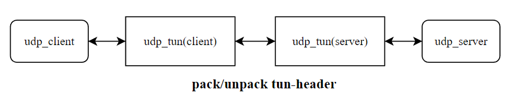
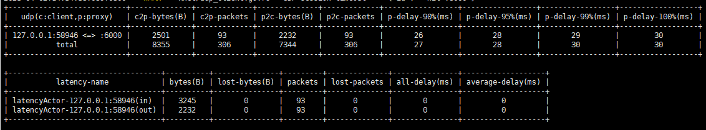
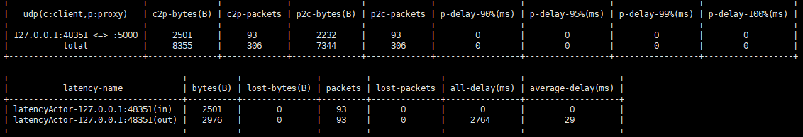

# gotu

* go version 1.18

## 项目结构

* pkg：底层/中间层封装
  * xlog：日志库
  * xnet:：网络库，目前支持tcp，udp，kcp，websocket
    * 网络层读写分离，未强制控制读写数据时序
  * xmsg：数据包分割
  * xactor：actor模式
  * xcommon：通用模块
  * xlatency：延迟模拟模块
* script：脚本
  * build_all.sh：编译
* cmd：逻辑代码
  * udp_cli：测试udp client
  * udp_svr：测试udp server
  * udp_tun：udp 流量转发工具
    * normal mode：单点代理模式, 支持模拟出入站延迟，丢包

      

      数据统计

      
    * client/server mode：双端代理模式，支持统计延迟

      

      client proxy 数据统计

      

      server proxy 数据统计(开启出站延迟)

      
