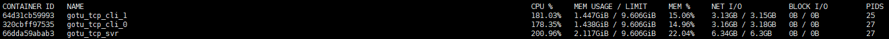

# TCP_TEST

tcp conn 负载测试："**百万连接测试**"，仅为测试方案构思

* 测试未完成：由于目前的封装方式（读写分离双协程模式），构建协程过多（内存空间占用过大），本人测试环境（6核9G）
  * 业内tcp conn "**百万连接测试**"，测试目的绝大部分为百万链接占用内存大小，并未结合相关业务，意义不大
* docker：单机下基于 虚拟网卡(docker0) 构建多容器(ip/port)环境，产生大量tcp连接
* client：每个协程建立一个tcp client
  * echo：500ms
  * delay：暂时未统计
* 7w 连接测试：经推算目前环境，svr/cli分离，svr极限可以负载，20w连接左右
  * tcp_svr: cpu(2核)，mem(2.11GB)
