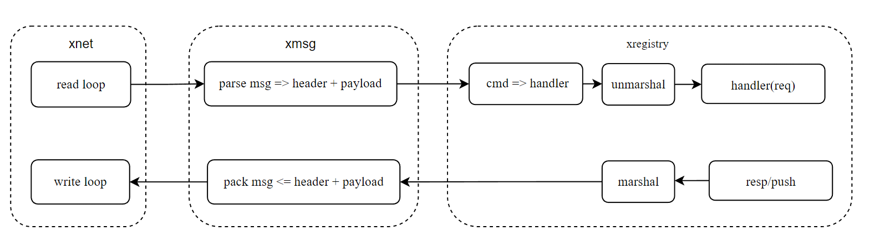

# XREGISTRY

* 注册器：统一管理 cmd, msg, hander 映射关系
* 网络处理流程：
  * 发送：req/resp/push(逻辑层数据结构) => Marshal(自定义序列化, payload) => xmsg (打包完整数据包 msg : header + payload) => xnet (msg：[]byte)
  * 接收:   xnet(msg：[]byte) => xmsg (解析msg：header+payload) =》xregistry(寻找 cmd, handler ) =》 Unmarshal(自定义反序列化, payload) => hander(执行 handler(req/resp/push))
    * msg([]byte) : header + payload
    * header ([]byte) : marshal(seq(int32) + cmd(int32) + flag(int32) + len(int32)), 目前采用binary
    * payload([]byte):  marshal(rep/resp/push), 此处序列化可自定义方案(binary/protobuf/json....)
  * 服务端处理流程
